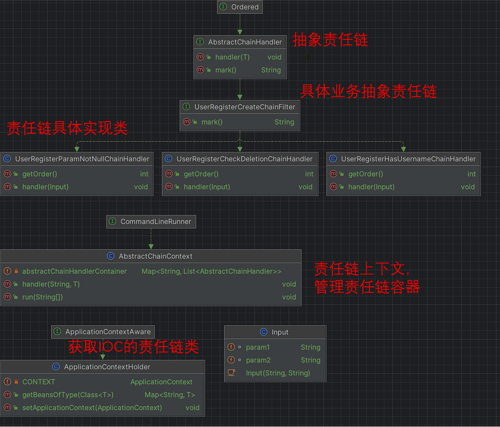

# 责任链模式的实现
## 概念
### 1. 什么是责任链
   责任链设计模式是一种行为型设计模式，其主要目的是解耦请求发送者和请求接收者，让多个对象都有机会处理请求，从而避免请求发送者和接收者之间的紧耦合。

责任链模式的核心是一个链式结构，链中每个节点代表一个处理者对象，请求先经过第一个节点处理，如果该节点能够处理请求，则直接返回处理结果；否则，请求继续往下一个节点传递，直到找到能够处理该请求的节点为止。整个过程类似于流水线上的多个工作站，每个工作站负责一项工作，如果自己处理不了，就将工作交给下一个工作站，直到整个工作完成。

在责任链模式中，每个处理者对象都有一个指向下一个处理者对象的引用，这样就形成了一个处理者链。请求发送者只需要将请求发送给第一个节点即可，而不用关心请求会被哪个处理者对象处理。由于每个处理者对象都有机会处理请求，因此责任链模式可以实现请求的动态分配。
### 2. 优缺点
   责任链模式的优点在于，它可以动态地添加、删除和调整处理者对象，从而灵活地构建处理链。同时，它也避免了请求发送者和接收者之间的紧耦合，增强了系统的灵活性和可扩展性。

不过，责任链模式也有一定的缺点，例如如果处理链过长或者处理时间过长，可能会对系统性能产生一定的影响。
### 3. 应用场景
   在实际应用中，责任链模式常用于请求的预处理、请求的过滤、请求的分发等场景。例如，可以使用责任链模式来实现权限校验、日志记录、异常处理、请求重试等功能。同时，也可以将责任链模式与其他设计模式结合起来，例如装饰器模式、工厂模式、观察者模式等，从而实现更复杂的功能。
   
## 设计
代码中添加了一定的注解帮助理解，具体的设计见下图

